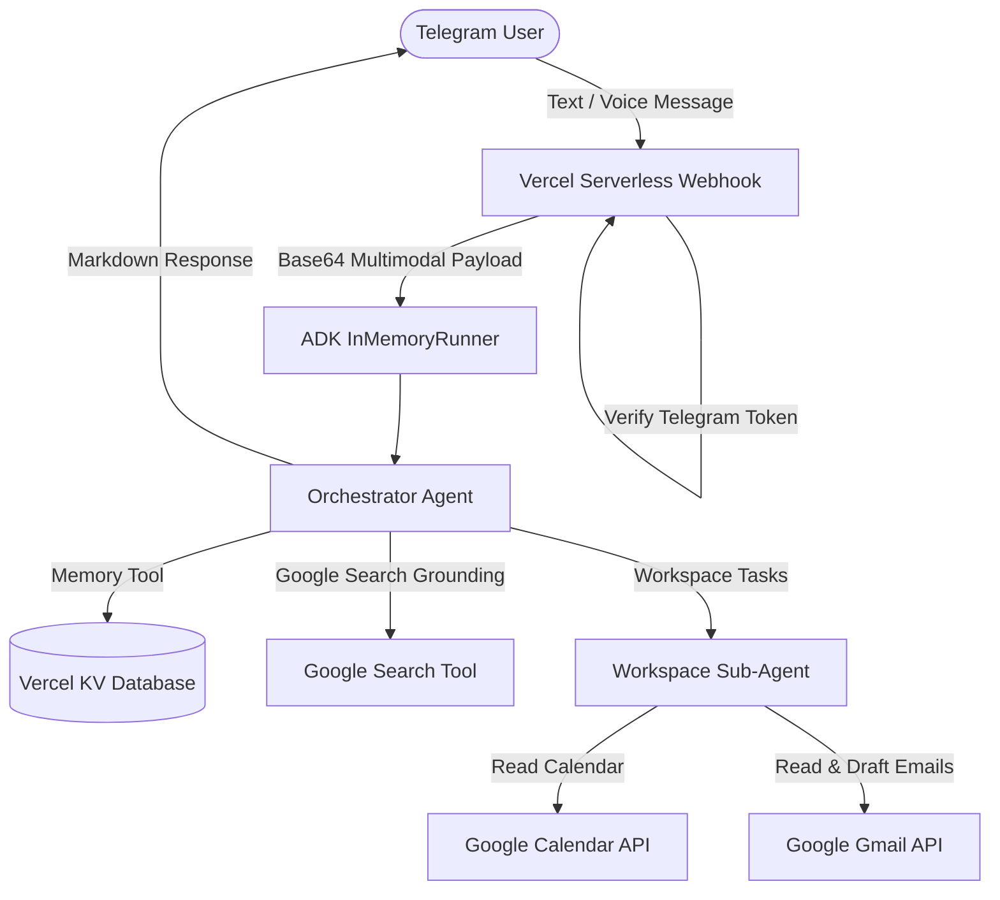

<div align="center">

# 🤖 Personal Assistant Bot

### An Autonomous Multimodal Assistant powered by Google ADK & Vercel KV

[](https://aistudio.google.com)
[](https://www.typescriptlang.org/)
[](https://vercel.com)
[](https://core.telegram.org/bots)

**PersonalAgent** is an open-source, serverless Telegram bot powered by the **Google Agent Development Kit (ADK)** and next-generation Gemini models. It listens to text and voice notes, queries calendars, reads and drafts emails, remembers your preferences, and searches the web in real time.

[🚀 Quick Start](#-quick-start) · [🛠️ Architecture](#-system-architecture) · [⚙️ Configuration](#-step-by-step-setup-guide) · [🧪 Local Testing](#-testing)

---

</div>

---

## 🌟 What is PersonalAgent?

Instead of relying on single prompts or manual queries, **PersonalAgent** uses a central Orchestrator that parses prompts (written or spoken) and delegates them to specialized workers. It connects directly with Google APIs to manage your workspace and keeps facts stored in a serverless database.

> **Multimodal Processing:** Gemini understands Opus/OGG audio files directly. You can speak to the bot, and it will list appointments, draft replies, or check the weather forecasts seamlessly.

---

## ✨ Features

| Feature | Description |
|---|---|
| 🎙️ **Native Voice Support** | Telegram audio messages are processed natively by Gemini without an external speech-to-text parser. |
| 📅 **Calendar Sync** | Fetches your upcoming events from Google Calendar in your localized timezone. |
| 📩 **Gmail Summarizer** | Lists and summarizes emails received today. |
| 📝 **Smart Drafting** | Prompts for recipient details, subject, and content to create Gmail drafts. |
| 🔍 **Search Grounding** | Uses live Google Search to confirm real-time facts, news, and weather forecast feasibility. |
| 🧠 **Memory Bank** | Saves user details (name, preferred honorific, timezone) persistently in Vercel KV. |

---

## 🛠️ System Architecture

Our assistant uses the Orchestrator-Worker pattern to route prompts:



---

## ⚙️ Step-by-Step Setup Guide

Follow these steps to configure, build, and run the project from scratch.

### Step 1: Create a Telegram Bot
1. Open Telegram and search for [@BotFather](https://t.me/BotFather).
2. Start a chat and send the command `/newbot`.
3. Choose a name and a username for your bot.
4. Copy the generated HTTP API Token (this will be `TELEGRAM_BOT_TOKEN`).
5. Open Telegram, search for [@userinfobot](https://t.me/userinfobot), start a chat, and note down your Telegram ID (this will be `TELEGRAM_ALLOWED_USER_ID` for security).

### Step 2: Configure Google Cloud & OAuth2 Credentials
1. Go to the [Google Cloud Console](https://console.cloud.google.com/).
2. Create a new project.
3. Enable the **Google Calendar API** and the **Gmail API** in the API Library.
4. Go to **OAuth Consent Screen**:
   - Choose **External** user type.
   - Set up application details.
   - Add the scopes:
     - `.../auth/calendar.readonly`
     - `.../auth/gmail.readonly`
     - `.../auth/gmail.compose` (or `.../auth/gmail.modify`)
   - Add your Gmail address as a test user.
5. Go to **Credentials**:
   - Click **Create Credentials** -> **OAuth Client ID**.
   - Select **Web Application**.
   - Under **Authorized redirect URIs**, add `http://localhost:8080/oauth2callback`.
   - Copy your **Client ID** (`GOOGLE_CLIENT_ID`) and **Client Secret** (`GOOGLE_CLIENT_SECRET`).

### Step 3: Get Your Google Refresh Token
1. In the root directory, create a `.env` file containing your `GOOGLE_CLIENT_ID` and `GOOGLE_CLIENT_SECRET`.
2. Run the helper script to authenticate:
   ```bash
   node dist/brain/275a7436-c4f5-4986-9ffc-b4133c24a6ba/scratch/generate-tokens.js
   ```
3. Copy the URL printed in the terminal, open it in your browser, and authorize access.
4. After authorization, copy the generated token printed in your terminal (this will be `GOOGLE_REFRESH_TOKEN`).

### Step 4: Configure Vercel KV Database (Redis)
1. Go to the [Vercel Dashboard](https://vercel.com) and create a project/account.
2. In your Vercel Dashboard, go to **Storage** and click **Create Database** -> **KV (Redis)**.
3. Connect the KV Database to your project.
4. Note down the credentials:
   - `KV_REST_API_URL`
   - `KV_REST_API_TOKEN`

### Step 5: Fill Your `.env` File
Create a `.env` file in the root of the workspace:
```env
TELEGRAM_BOT_TOKEN="your_telegram_bot_token"
TELEGRAM_ALLOWED_USER_ID="your_telegram_user_id"
TELEGRAM_SECRET_TOKEN="any_secure_random_string"

GOOGLE_CLIENT_ID="your_google_client_id"
GOOGLE_CLIENT_SECRET="your_google_client_secret"
GOOGLE_REFRESH_TOKEN="your_oauth_refresh_token"

GEMINI_API_KEY="your_gemini_api_key"
GEMINI_MODEL="gemini-2.5-flash"

KV_REST_API_URL="https://..."
KV_REST_API_TOKEN="..."
```

---

## 🚀 Quick Start

### 1. Install Dependencies
```bash
npm install
```

### 2. Compile the Project
```bash
npm run build
```

### 3. Run Locally with Vercel Dev
Start your local serverless sandbox:
```bash
npx vercel dev
```

### 4. Create Webhook Tunnel
For Telegram to send messages to your local instance, set up a localtunnel proxy on port `3000`:
```bash
npx localtunnel --port 3000 --local-host 127.0.0.1
```
Use the public HTTPS URL provided by localtunnel to configure Telegram's webhook:
```bash
curl -X POST "https://api.telegram.org/bot<TELEGRAM_BOT_TOKEN>/setWebhook" \
     -H "Content-Type: application/json" \
     -d '{"url": "https://<YOUR_TUNNEL_URL>/api/webhook", "secret_token": "<TELEGRAM_SECRET_TOKEN>"}'
```

---

## 🧪 Testing

We provide a full-scale integration suite that verifies your database, Google tokens, and Gemini connection.

Run the test suite:
```bash
node dist/src/test-integration.js
```
Expected output:
```text
=== STARTING INTEGRATION TESTS ===

1. Testing Vercel KV Database Connection...
   ✅ DB Write and Read OK! Stored: "TestUser-...", Fetched: "TestUser-..."

2. Testing Google OAuth2 Client and Calendar API...
   ✅ Google OAuth token is VALID! Scopes authorized: [...]
   ✅ Calendar retrieved: ...

3. Testing Gmail API Access...
   ✅ Gmail list retrieved: ...

4. Testing Gemini Agent Orchestration with Multimodal Audio Context simulation...
   Sending mock audio message to agent runner...
   ✅ Agent Response OK! length: ... chars.

=== INTEGRATION TESTS COMPLETED ===
```

---

## 🔒 Security & Git Checks

1. **`.env` Ignored**: Ensure your `.env` secrets are never pushed to GitHub (already handled by `.gitignore`).
2. **Authorized ID Access**: All incoming Telegram webhooks verify the `TELEGRAM_ALLOWED_USER_ID` to block unauthorized users.
3. **Secret Token Handshake**: The webhook headers verify `X-Telegram-Bot-Api-Secret-Token` ensuring requests originate strictly from Telegram.

---

## 👨‍💻 About the Author

<div align="center">  
  Hello, my name is **Isaac Sa**. I have been developing systems for over 20 years. This project is a practical application of the knowledge I acquired when completing Google's **Agent Development Kit (ADK) course**, which I highly recommend taking! You can check it out here: [Google ADK Course](https://www.skills.google/paths?pathslistid=agents).
</div>

Let's connect:
- **Personal Website:** [isaacsa.com](https://isaacsa.com)
- **Email:** hi@isaacsa.com
- **GitHub:** [github.com/isaacoliveirasa](https://github.com/isaacoliveirasa/)
- **Google Developer Community:** Join us on [Discord](https://discord.gg/9w9hEj3Z)

<div align="center">  
   
</div>

---

## 📄 License
This project is open-source and licensed under the MIT License.

